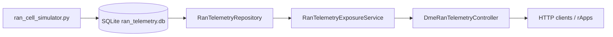

# DME Integration & RAN Telemetry Documentation

This document summarizes the **Data Management Enabler (DME)** integration in the rApp Starter Kit, including how simulated 5G RAN KPI data flows from the Python cell simulator into a SQLite database and is exposed over HTTP.

## Overview

The integration connects two components:

1. **`ran_cell_simulator.py`** — Python simulator that models 100 NR cells (`cell-1` … `cell-100`) and continuously writes telemetry to SQLite.
2. **`rapp-manager-dme`** — Spring Boot module that reads the SQLite store and exposes KPI data via REST endpoints on the rApp Manager application (port `8080`).



## Steps Completed

| Step | Description |
|------|-------------|
| 1 | Created `rapp-manager-models/scripts/ran_cell_simulator.py` to simulate 100 cells with RSRP, RSRQ, active users, and PRB utilization |
| 2 | Defined SQLite schema (`cells`, `cell_latest`, `cell_telemetry`) and default DB path under `rapp-manager-models/data/` |
| 3 | Extended `DmeConfiguration` with telemetry settings (`database-path`, `api-base-path`, `enabled`) |
| 4 | Implemented `RanTelemetryRepository`, `RanTelemetryExposureService`, and `DmeRanTelemetryController` in `rapp-manager-dme` |
| 5 | Added domain models `CellKpiTelemetry` and `NetworkKpiSummary` in `rapp-manager-models` |
| 6 | Registered exception handling for `DmeTelemetryException` in `ExceptionControllerHandler` |
| 7 | Added integration tests in `DmeRanTelemetryControllerTests` |
| 8 | Updated `application.yaml` with DME telemetry configuration |

## Simulator

**Location:** `rapp-manager-models/scripts/ran_cell_simulator.py`

**Dependencies:** `rapp-manager-models/scripts/requirements.txt` (`numpy`, `matplotlib`)

### Simulation model

| KPI | Model |
|-----|-------|
| **RSRP** | Gaussian random walk + log-normal shadow fading (dB), clamped to -120 … -70 dBm |
| **Active users** | Poisson arrivals, exponential (Poisson) departures per tick |
| **PRB utilization** | `Beta(α, β) × (active_users / max_users) × 100` |
| **RSRQ** | Correlated with RSRP quality and traffic load; O-RAN critical threshold at **-12 dB** |

### Run the simulator

```powershell
cd rapp-manager-models\scripts
python -m pip install -r requirements.txt
python ran_cell_simulator.py --no-chart
```

With live matplotlib chart (weighted network KPI averages):

```powershell
python ran_cell_simulator.py
```

**Default database path:** `rapp-manager-models/data/ran_telemetry.db`

Override via CLI or environment:

```powershell
python ran_cell_simulator.py --db-path "C:\path\to\ran_telemetry.db"
# or
$env:RAN_TELEMETRY_DB = "C:\path\to\ran_telemetry.db"
```

## Telemetry Database (SQLite)

### Schema

| Table | Purpose |
|-------|---------|
| `cells` | Registry of simulated cell IDs (`cell-1` … `cell-100`) |
| `cell_latest` | Most recent KPI snapshot per cell (upserted each tick) |
| `cell_telemetry` | Time-series history of all KPI samples |

### KPI columns

| Column | Type | Description |
|--------|------|-------------|
| `cell_id` | TEXT | Cell identifier |
| `recorded_at` | TEXT (ISO-8601 UTC) | Sample timestamp |
| `rsrp_dbm` | REAL | Reference Signal Received Power (dBm) |
| `rsrq_db` | REAL | Reference Signal Received Quality (dB) |
| `active_users` | INTEGER | Active UE count |
| `prb_utilization` | REAL | PRB utilization (%) |

### O-RAN reference thresholds

| KPI | Critical threshold |
|-----|-------------------|
| RSRQ | < -12.0 dB |
| PRB utilization | > 80.0 % |

## DME Module (`rapp-manager-dme`)

### Key components

| Component | Package | Role |
|-----------|---------|------|
| `DmeConfiguration` | `dme.configuration` | Binds `rappmanager.dme.*` properties |
| `DmeTelemetryDataSourceConfiguration` | `dme.configuration` | SQLite `DataSource` and `JdbcTemplate` |
| `RanTelemetryRepository` | `dme.repository` | JDBC queries against simulator tables |
| `RanTelemetryExposureService` | `dme.service` | Business logic and weighted KPI summary |
| `DmeRanTelemetryController` | `dme.rest` | HTTP REST exposure endpoints |
| `DmeDeployer` | `dme.service` | rApp lifecycle deployer (existing DME stub) |

### Domain models (`rapp-manager-models`)

| Model | Package | Purpose |
|-------|---------|---------|
| `CellKpiTelemetry` | `models.dme` | Per-cell KPI response DTO |
| `NetworkKpiSummary` | `models.dme` | Active-user-weighted network averages |
| `DmeTelemetryException` | `models.exception` | API errors (404 / 503) |

## Configuration

Settings in `rapp-manager-application/src/main/resources/application.yaml`:

```yaml
rappmanager:
  dme:
    baseurl: http://localhost:9082          # External O-RAN DME endpoint
    telemetry:
      enabled: true
      database-path: ../rapp-manager-models/data/ran_telemetry.db
      api-base-path: /dme/ran-telemetry/v1
```

| Property | Default | Description |
|----------|---------|-------------|
| `rappmanager.dme.baseurl` | `http://localhost:9082` | External DME platform URL (lifecycle integration) |
| `rappmanager.dme.telemetry.enabled` | `true` | Enable/disable telemetry REST endpoints |
| `rappmanager.dme.telemetry.database-path` | `../rapp-manager-models/data/ran_telemetry.db` | Path to simulator SQLite file (relative to working directory) |
| `rappmanager.dme.telemetry.api-base-path` | `/dme/ran-telemetry/v1` | HTTP base path for KPI exposure |

Set `telemetry.enabled: false` to disable the telemetry API without removing the DME module.

## REST API

Base URL: `http://localhost:8080/dme/ran-telemetry/v1`

| Method | Path | Description |
|--------|------|-------------|
| GET | `/cells` | List all cell IDs |
| GET | `/kpi/latest` | Latest KPIs for all cells |
| GET | `/kpi/latest/{cellId}` | Latest KPI for one cell |
| GET | `/kpi/history/{cellId}?limit=60` | Historical samples (1–1000) |
| GET | `/kpi/summary` | Network-wide active-user-weighted averages |
| GET | `/info` | Exposure metadata (paths, DME base URL) |

### Example responses

**Single cell (`GET /kpi/latest/cell-1`):**

```json
{
  "cellId": "cell-1",
  "rsrp": -95.2,
  "rsrq": -11.4,
  "activeUsers": 218,
  "prbUtilization": 42.7,
  "recordedAt": "2026-07-07T13:30:00Z"
}
```

**Network summary (`GET /kpi/summary`):**

```json
{
  "recordedAt": "2026-07-07T13:30:00Z",
  "cellCount": 100,
  "weightedRsrp": -96.8,
  "weightedRsrq": -11.2,
  "weightedActiveUsers": 215.4,
  "weightedPrbUtilization": 38.6
}
```

### Example requests

```powershell
curl http://localhost:8080/dme/ran-telemetry/v1/info
curl http://localhost:8080/dme/ran-telemetry/v1/kpi/summary
curl http://localhost:8080/dme/ran-telemetry/v1/kpi/latest/cell-1
curl "http://localhost:8080/dme/ran-telemetry/v1/kpi/history/cell-1?limit=30"
```

## End-to-End Runbook

### Terminal 1 — Simulator

```powershell
cd rapp-manager-models\scripts
python ran_cell_simulator.py --no-chart
```

### Terminal 2 — rApp Manager (KPI API)

Build (required after changes to `rapp-manager-models` or `rapp-manager-dme`):

```powershell
cd <project-root>
mvn clean install -pl rapp-manager-application -am -DskipTests
```

Start:

```powershell
cd rapp-manager-application
mvn spring-boot:run
```

### Terminal 3 — Verify

```powershell
curl http://localhost:8080/dme/ran-telemetry/v1/kpi/summary
```

## Troubleshooting

| Issue | Cause | Fix |
|-------|-------|-----|
| `ClassNotFoundException: DmeTelemetryException` | Stale build after adding new model classes | Run `mvn clean install -pl rapp-manager-application -am` from project root |
| `Port 8080 was already in use` | Previous `spring-boot:run` still running | `netstat -ano \| findstr :8080` then `Stop-Process -Id <PID> -Force` |
| `503` — database unavailable | Simulator not running or DB path misconfigured | Start `ran_cell_simulator.py`; verify `database-path` in `application.yaml` |
| `404` — no telemetry for cell | Cell ID not in database | Ensure simulator has seeded `cell-1` … `cell-100` |
| Empty or stale KPIs | Simulator stopped | Restart simulator; confirm `rapp-manager-models/data/ran_telemetry.db` is updating |

## Related Files

```
rapp-manager-models/
  scripts/ran_cell_simulator.py      # 5G RAN cell simulator
  scripts/requirements.txt           # Python dependencies
  data/ran_telemetry.db              # SQLite telemetry store (created at runtime)
  src/main/java/.../models/dme/      # KPI DTOs

rapp-manager-dme/
  src/main/java/.../dme/
    configuration/                   # DmeConfiguration, DataSource setup
    repository/                      # RanTelemetryRepository
    service/                         # RanTelemetryExposureService, DmeDeployer
    rest/                            # DmeRanTelemetryController

rapp-manager-application/
  src/main/resources/application.yaml
  src/test/java/.../dme/DmeRanTelemetryControllerTests.java
```

## Reference

- [O-RAN SC rApp Manager documentation](https://docs.o-ran-sc.org/projects/o-ran-sc-nonrtric-plt-rappmanager/en/latest/)
- Project `README.md` — general build and run instructions
